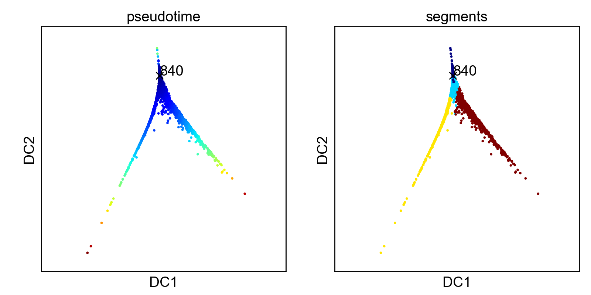
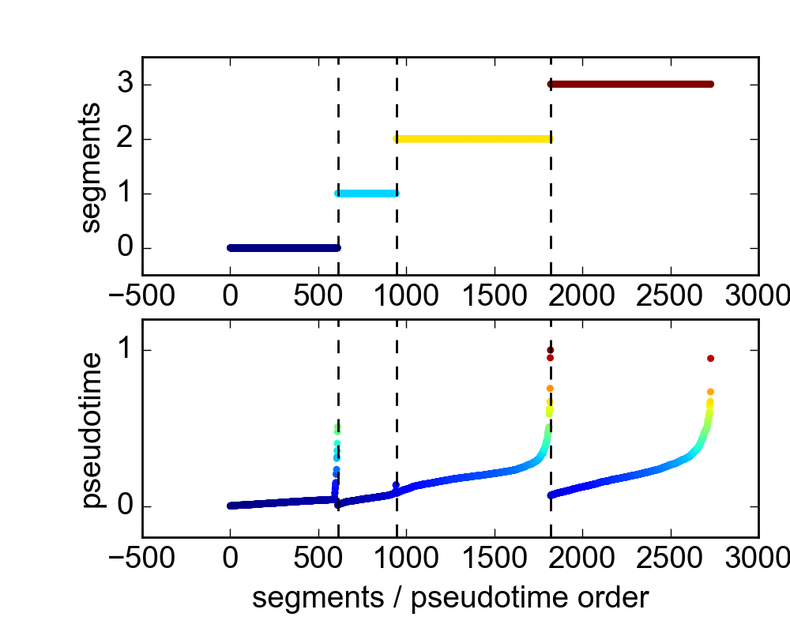

[Examples](#examples) | 
[Tools](#tools) | 
[Comparable Software](#compsoftware) | 
[Installation](#install) | 
[References](#references)

# scanpy - **s**ingle-**c**ell **an**alysis in **py**thon

!! This is just a testing version that solely includes DPT and diffusion maps. !!

!! Comments are welcome. !!

Tools for analyzing and simulating single-cell data that aim at an understanding
of dynamic biological processes from snapshots of transcriptome or 
proteome.

* [dpt.py](scanpy/dpt.py) - Perform **D**iffusion **P**seudo**t**ime
analysis of data as of [Haghverdi *et al.*, Nat. Meth. 13, 845 (2016)](#haghverdi16).

* [diffmap.py](scanpy/diffmap.py) - Compute **Diff**usion **Map**
representation of data as of [Coifman *et al.*, PNAS, 102, 7426
(2005)](#coifman05).

## Examples <a id="examples"></a>

The following examples assume you use the Python scripts in [tools](tools),
which work **without** [installation](#Installation). You might modify these
scripts to your own taste, for example, by adding more examples in
[tools/preprocess.py](tools/preprocess.py). In case you prefer working with
[jupyter notebooks](http://jupyter.org/), you might look at examples in
[examples/examples.ipynb](examples/examples.ipynb).

Download or clone the repository and `cd` into its root directory. The package
has been tested using a [Anaconda](https://www.continuum.io/downloads)
environments for Python 2 and 3.

#### Data of [Paul *et al.* (2015)](#paul15)

Segment 1 corresponds to a branch of granulocyte/macrophage progenitors (GMP), 
segment 3 corresponds to a branch of megakaryocyte/erythrocyte progenitors (MEP). 
```shell
$ python tools/dpt.py paul15
```


#### Data of [Moignard *et al.* (2015)](#moignard15)

Segment 3 corresponds to a branch of erythorocytes, segment 1 and 2 to a branch
of endothelial cells.
```shell
$ python tools/dpt.py moignard15
```


In case you just want to get a quick visualization using the diffusion map 
representation.
```shell
$ python tools/diffmap.py moignard15
```


#### Your own example

We are not satisfied with taking the logarithm of the count matrix before
running DPT for the data of [Paul *et al.* (2015)](#paul15) as in example
`paul15` above. We copy the entry `paul15` from the dicionary `examples` in
[scanpy/preprocess.py](scanpy/preprocess.py) and paste it into the dictionary 
`examples` in [tools/preprocess.py](tools/preprocess.py). We then rewrite the key 
of the new entry to `"paul15_nolog"`. We do the same with the function
`paul15`, and rewrite it without the log transform and the new name
`paul15_nolog`.

Running the new example, we now identify segment 3 with the branch of
granulocyte/macrophage progenitors (GMP) and segment 2 with the branch of
megakaryocyte/erythrocyte progenitors (MEP).
```shell
$ python tools/dpt.py paul15_nolog
```



#### Simulated myeloid progenitor data ([Krumsiek *et al.*, 2011](#krumsiek11))

Here, we are going to simulate some data using a literature curated boolean gene
regulatory network, which is believed to describe myeloid differentiation
([Krumsiek *et al.*, 2011](#krumsiek11)). Using [sim.py](scanpy/sim.py), the
[boolean model](models/krumsiek11.txt) is translated into a stochastic ordinary
differential equation ([Wittman *et al.*, 2009](#wittman09)). Simulations result
in branching time series of gene expression, where each branch corresponds to a
certain cell fate of common myeloid progenitors (megakaryocytes, erythrocytes,
granulocytes and monocytes).
```shell
$ python tools/sim.py krumsiek11
```


If the order is shuffled, as in a snapshot, the same data looks as follows


Let us reconstruct an order according to estimating geodesic distance with
DPT. By that, we obtain the branching lineage using
```shell
$ python tools/dpt.py krumsiek11
```


The left panel illustrates how the data is organized according to a *pseudotime*
and different *segments*. Pseudotime is an estimator of geodesic distance on the
manifold from an *initial point*. Segments are discrete partitions of the
data. Both can be visualized in the diffusion map representation.


## Tools <a id="tools"></a>

Here, each tool is described in more detail.

### diffmap and dpt

[diffmap.py](tools/diffmap.py) implements *diffusion maps* [Coifman *et al.*
(2005)](#coifman05), which has been proposed for visualizing single-cell data by
[Haghverdi *et al.* (2015)](#haghverdi15). Also, [diffmap.py](tools/diffmap.py)
accounts for modifications to the original algorithm proposed by [Haghverdi *et
al.* (2016)](#haghverdi16).

[dpt.py](scanpy/dpt.py) implements Diffusion Pseudotime as introduced by [Haghverdi *et
al.* (2016)](#haghverdi16).

The functions of these two tools compare to the R package *destiny* of [Angerer
*et al.* (2015)](#angerer16).

## Comparable Software

This section compiles software packages that are comparable to scanpy, but
differ substantially in implementation, usage and tools provided. A more
comprehensive list can be found
[here](https://github.com/seandavi/awesome-single-cell).

* [Destiny](http://bioconductor.org/packages/release/bioc/html/destiny.html) - [R] -
Diffusion Maps and Diffusion Pseudotime in R as of [Angerer *et al.*
(2015)](#angerer16).

## Installation <a id="compsoftware"></a>

For usage of the scripts in tools from the root of the repository, no
installation is needed.

If you want to `import scanpy` from anywhere on your system, you can install it
locally via

```shell
$ pip install .
```

You can also install the package with symlinks, so that changes on your version
of the package become immediately available
```shell
$ pip install -e .
```

Your work on the scripts in [tools](tools) will not be affected by
installation. These scripts insert the root of the repository at the beginning
of the search path via `sys.path.insert(0,'.')` and hence load `scanpy` locally.

## References <a id="references"></a>

<a id="angerer15"></a>
Angerer *et al.* (2015), *destiny - diffusion maps for large-scale single-cell
data in R*, [Bioinformatics 32, 1241]( http://dx.doi.org/10.1038/nmeth.3971).

<a id="coifman05"></a>
Coifman *et al.* (2005), *Geometric diffusions as a tool for harmonic analysis and
structure definition of data: Diffusion maps*, [PNAS 102, 7426](
http://dx.doi.org/10.1038/nmeth.3971).

<a id="haghverdi15"></a>
Haghverdi *et al.* (2015), *Diffusion maps for high-dimensional single-cell
analysis of differentiation data*, [Bioinformatics 31, 2989](
http://dx.doi.org/10.1093/bioinformatics/btv325).

<a id="haghverdi16"></a>
Haghverdi *et al.* (2016), *Diffusion pseudotime robustly
reconstructs branching cellular lineages*, [Nature Methods 13, 845](
http://dx.doi.org/10.1038/nmeth.3971).

<a id="moignard15"></a>
Moignard *et al.* (2015), *Decoding the regulatory network of early blood
development from single-cell gene expression measurements*, [Nature Biotechnology 33,
269](
http://dx.doi.org/10.1038/nbt.3154).

<a id="paul15"></a>
Paul *et al.* (2015), *Transcriptional Heterogeneity and Lineage Commitment in Myeloid Progenitors*, [Cell 163,
1663](
http://dx.doi.org/10.1016/j.cell.2015.11.013).

<a id="wittman09"></a>
Wittman *et al.* (2009), *Transforming Boolean models to
continuous models: methodology and application to T-cell receptor signaling*,
[BMC Systems Biology 3, 98](
http://dx.doi.org/10.1186/1752-0509-3-98).

